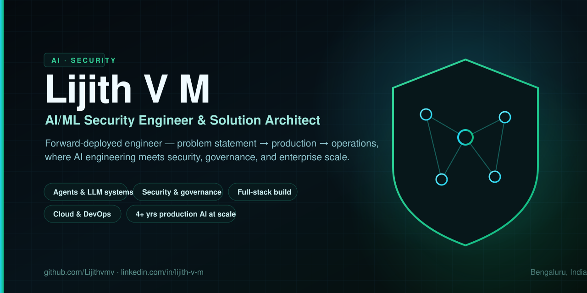

  

# Hi, I'm Lijith 👋

### AI/ML Security Engineer & Solution Architect · Bengaluru, India

> **Forward-deployed engineer** — I take AI products from problem statement to production and own them there end to end: architecture, full-stack build, deployment, and operations — under real enterprise security, approval-gate, and scale constraints.

For **4+ years** I've shipped **production AI at enterprise scale** — usually as the whole delivery
unit: product and architecture, backend and frontend, DevOps and deployment, and reporting to senior
leadership. My work sits where **AI engineering meets security and governance**, so I design the
controls in from day one rather than bolt them on, and I ship through real approval gates instead of
stopping at a demo. When something has to go from *idea* to *live, monitored system*, I'm the person
who carries it the whole way.

My range is the part I'd point to. I started in **applied ML and computer vision**, moved into
**production multi-agent GenAI platforms**, and now build **secure agentic systems and GRC
automation** — so I can move from the model layer to the prompt layer to the business and compliance
layer in one conversation.

🎓 DeepLearning.AI Machine Learning Specialization · Microsoft Azure AI Engineer (AI-102), certified 2024

### 🧭 What I do — end to end
- **Architect** enterprise AI: multi-agent orchestration (LangGraph), enterprise RAG / GraphRAG over knowledge graphs and vector stores, and the security & governance controls designed in from day one.
- **Build** full-stack: Python / FastAPI microservices, React / TypeScript SPAs, async workers (Celery), SQLAlchemy / Alembic, and the evaluation harnesses that prove a system works — not just demos.
- **Deploy & operate**: containerized on Kubernetes across Azure and GCP, with Terraform IaC, CI/CD, managed-identity secrets, and observability.
- **Secure & govern**: prompt-injection defense, guardrails, tool-call & egress policy, RBAC / non-human identity, agent evaluation & red-teaming, and GRC frameworks (ISO 27001 · PCI DSS · DPDP).

### 💼 Selected experience
- **Production multi-agent GenAI platform** — 30+ agents orchestrated in LangGraph with a runtime **plugin architecture** (agents and workflows loaded from configuration, not hardcoded), typed shared state with custom reducers, and parallel execution. Multi-tenant, with a JWT-driven security context and per-tenant data isolation enforced before retrieval.
- **Enterprise RAG at scale** — hybrid vector search (HNSW) over **100K+ records** with metadata tenant isolation and audit logging. Re-architected embedding generation from per-item to batched calls, cutting **P95 latency 36s → 2s and cost ~96%**.
- **Agentic GRC & security-automation platforms** — knowledge-graph controls, evidence pipelines, human-in-the-loop approval gates, and a hybrid **deterministic-agentic** design (*"AI writes the rules and the words; deterministic code computes the numbers"*) for a large enterprise security organization; sole architect and builder.
- **Enterprise-scale cloud infrastructure** — Terraform-driven virtual-desktop platform with golden-image pipelines and a planned scale-out path to **300 VMs / 1,500 sessions**, cross-subscription private networking, and RBAC / managed-identity hardening.
- **Applied ML & computer vision** (earlier) — CNN document-image classification across 200+ component types, **GAN-based multi-view 3D / CAD generation** (hackathon winner), and regression models predicting engineering test outcomes at ~92% accuracy.

### 🚀 Open-source
| Project | What it is |
|---------|------------|
| **[SOC-Graph-Guard](https://github.com/Lijithvmv/SOC-Graph-Guard)** | A security-first agentic SOC on LangGraph: verdicts computed from evidence (never from attacker-written text), graded autonomy, human approval before irreversible actions, injection screening and a tamper-evident audit. On labelled attack scenarios: guarded graph 7/7 with zero unsafe actions vs a naive agent's 2/7. |
| **[GuardLayer](https://github.com/Lijithvmv/Guard-Layer)** | A production-grade security layer for LLM & agent apps — prompt-injection defense, tool-call & egress policy, session taint tracking, tamper-evident audit log. Zero-dependency core, hundreds of tests, an honest public benchmark. |
| **[Newton](https://github.com/Lijithvmv/newton)** | A fully local, offline coding agent that makes a small on-device model genuinely useful by planning work into verifiable steps and engineering its context. Took the same 7B model from 0/6 to 6/6 on cross-file tasks. |
| **[Sequel](https://github.com/Lijithvmv/Sequel)** | An agentic natural-language-to-SQL assistant with a dedicated validation stage — plain-English questions to correct, checked SQL. |

### 🧰 Tech stack

**AI & agents**

**Models & AI security**

**Backend & data**

**Cloud & infra**

**Frontend**

**ML**

### 📊 GitHub

